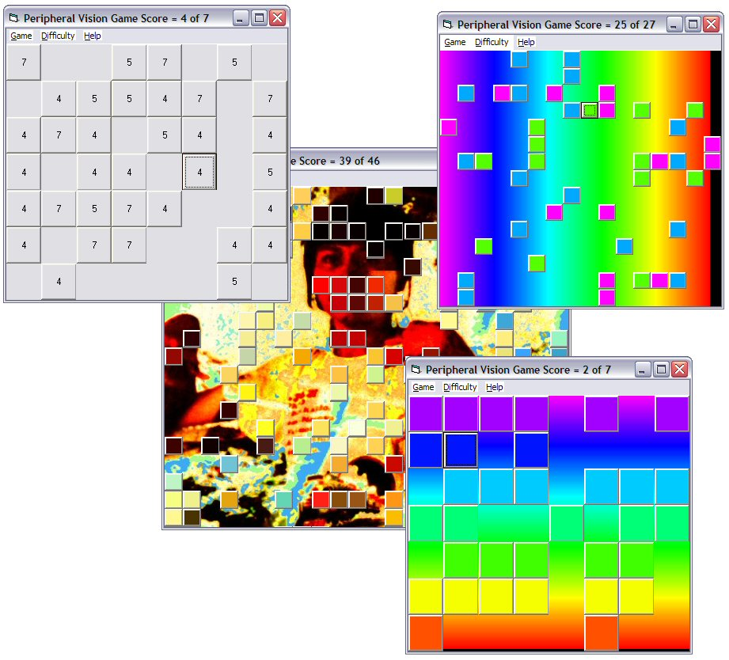



## Peripheral Vision Game

### Description

This is a simple game built while doddling with a couple of recent uploads; Ryan Spencer's 'A "Button" Form' txtCodeId=61380 and aditya8000's 'Visible Light Spectrum' txtCodeId=61446. Instead dozens of hand laid buttons this code uses a runtime generated array of buttons and an abstraction of aditya8000's code to detect and draw some colours. The Spectrum drawing routine (mine not aditya's) is not quite right and a black edge may appear at some form sizes, however the colour to wavelength and wavelength to colour routines work well.

Have fun.
 
### More Info
 

             |
---                |---
**Submitted On**   |2005-07-04 23:40:02
**By**             |[Roger Gilchrist](https://github.com/Planet-Source-Code/PSCIndex/blob/master/ByAuthor/roger-gilchrist.md)
**Level**          |Intermediate
**User Rating**    |4.8 (19 globes from 4 users)
**Compatibility**  |VB 6\.0
**Category**       |[Games](https://github.com/Planet-Source-Code/PSCIndex/blob/master/ByCategory/games__1-38.md)
**World**          |[Visual Basic](https://github.com/Planet-Source-Code/PSCIndex/blob/master/ByWorld/visual-basic.md)
**Archive File**   |[Peripheral190912742005\.zip](https://github.com/Planet-Source-Code/roger-gilchrist-peripheral-vision-game__1-61521/archive/master.zip)

